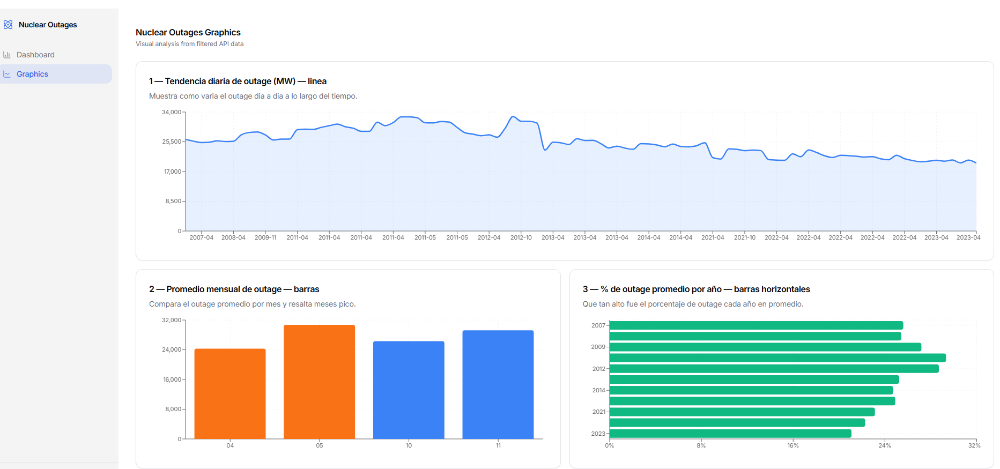
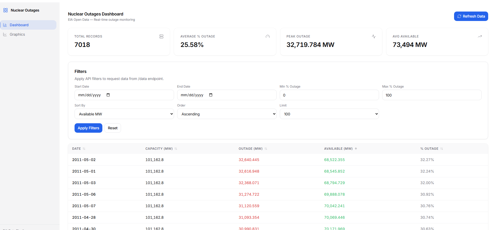
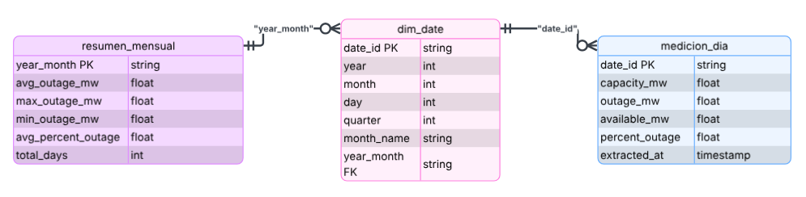
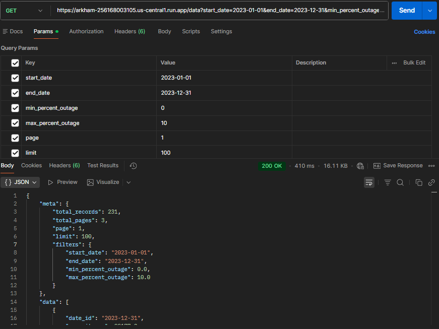
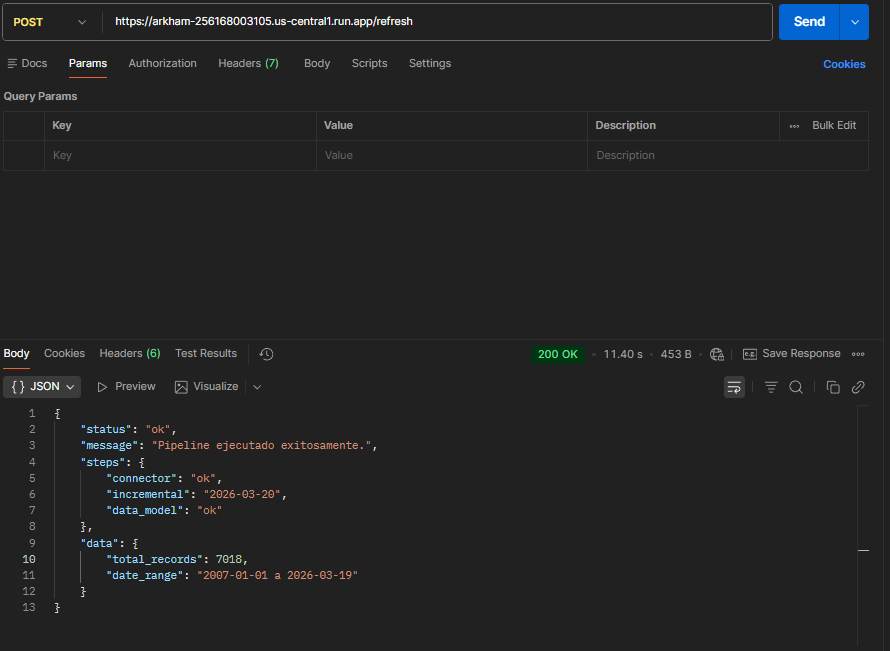

# Nuclear Outages Pipeline

Pipeline de datos que extrae información de outages nucleares desde la API de EIA, los almacena en Google Cloud Storage y los expone a través de una API de Google Cloud Run con un dashboard web.

---

## Arquitectura

```
EIA Open Data API
      |
      v
data_connector.py  →  Google Cloud Storage (Parquet)
      |                         |
      v                         v
data_model.py      →  Storage /model/ (dim_date, medicion_dia, resumen_mensual)
                                |
                                v
                           api.py (FastAPI)  →  Cloud Run
                                |
                                v
                         Frontend (React + Typescript)  →  GitHub Pages
```

---
## Dashboard


## Estructura del proyecto

```
arkham_api/
├── data_connector.py     # Extrae datos de la API de EIA y los sube a google
├── data_model.py         # Construye las 3 tablas del modelo desde google
├── api.py                # API REST con FastAPI
├── Dockerfile            # Imagen para Cloud Run
├── requirements.txt      # Dependencias Python
└── .env                  # Variables de entorno 

arkham/                    #Dashboard
├── src/
│   ├── components/       
│   └── pages/            
└── package.json
```

---

## Requisitos

- Python 3.12+
- Google Cloud SDK (`gcloud`)
- Docker Desktop
- Node.js 18+ (para el frontend)
- Cuenta en Google Cloud con los servicios habilitados:
  - Cloud Run
  - Artifact Registry
  - Cloud Storage

---

## Configuración inicial

### 1. Clonar el repositorio

```bash
git clone https://github.com/A01749099/arkham.git
cd arkham
```

### 2. Configurar variables de entorno

Crea un archivo `.env` en la carpeta `arkham_api/`:

```env
EIA_API_KEY=tu_api_key_de_eia
API_BASE_URL=https://api.eia.gov/v2/nuclear-outages/us-nuclear-outages/data/
GCS_BUCKET=""
GCS_PREFIX=""
```

Para obtener una API key de EIA: https://www.eia.gov/opendata/register.php

### 3. Instalar dependencias Python

```bash
pip install -r requirements.txt
```

---

## Uso local

### Extraer datos desde la API de EIA

```bash
# Extraer todo el histórico (2007 - hoy)
python data_connector.py
```

### Construir el modelo de datos

```bash
python data_model.py
```

Esto genera 3 tablas en GCS bajo `gs://arkham/nuclear-outages/model/`:

| Tabla | Descripción |
|---|---|
| `dim_date.parquet` | Dimensión de tiempo (año, mes, trimestre) |
| `medicion_dia.parquet` | Mediciones diarias de outage |
| `resumen_mensual.parquet` | Agregaciones mensuales pre-calculadas |

### Correr la API localmente

```bash
uvicorn api:app --reload
```

La API queda disponible en `http://localhost:8000`
Documentación interactiva: `http://localhost:8000/docs`

---

## Endpoints de la API

### `GET /data`

Retorna registros diarios de outages con filtros opcionales.

**Parámetros:**

| Parámetro | Tipo | Descripción |
|---|---|---|
| `start_date` | string | Fecha inicio (YYYY-MM-DD) |
| `end_date` | string | Fecha fin (YYYY-MM-DD) |
| `min_percent_outage` | float | % de outage mínimo (0-100) |
| `max_percent_outage` | float | % de outage máximo (0-100) |
| `page` | int | Número de página (default: 1) |
| `limit` | int | Registros por página (default: 100, max: 1000) |
| `sort_by` | string | Campo de ordenamiento |
| `order` | string | `asc` o `desc` |

**Campos de `sort_by`:** `date_id`, `capacity_mw`, `outage_mw`, `available_mw`, `percent_outage`

**Ejemplo:**
```bash
curl "http://localhost:8000/data?start_date=2023-01-01&end_date=2023-12-31&max_percent_outage=15"
```

**Respuesta:**
```json
{
  "meta": {
    "total_records": 287,
    "total_pages": 3,
    "page": 1,
    "limit": 100
  },
  "data": [
    {
      "date_id": "2023-12-31",
      "capacity_mw": 99177.2,
      "outage_mw": 6727.633,
      "available_mw": 92449.567,
      "percent_outage": 6.78
    }
  ]
}
```

---

### `POST /refresh`

Ejecuta el pipeline completo de extracción de forma incremental:
1. Detecta la última fecha almacenada en GCS
2. Descarga solo los datos nuevos desde esa fecha cumpliendo con Extracción incremental
3. Combina con los datos existentes
4. Regenera las 3 tablas del modelo

```bash
curl -X POST "http://localhost:8000/refresh"
```

**Respuesta:**
```json
{
  "status": "ok",
  "message": "Pipeline ejecutado exitosamente.",
  "steps": {
    "connector": "ok",
    "incremental": "2026-03-20",
    "data_model": "ok"
  },
  "data": {
    "total_records": 7018,
    "date_range": "2007-01-01 a 2026-03-19"
  }
}
```

---

### `GET /`

Health check básico.

```bash
curl "http://localhost:8000/"
```

---

## Deploy en Cloud Run

### 1. Autenticar con Google Cloud

```bash
gcloud auth login
gcloud config set project <>
```

### 2. Habilitar servicios

```bash
gcloud services enable run.googleapis.com
gcloud services enable artifactregistry.googleapis.com
gcloud services enable storage.googleapis.com
```

### 3. Construir y subir la imagen

```bash
gcloud auth configure-docker us-central1-docker.pkg.dev

docker build -t us-central1-docker.pkg.dev/api:latest .
docker push us-central1-docker.pkg.dev/api:latest
```

### 4. Deployar en Cloud Run

```bash
Se debera entrar a servicios y generar la API
```

---

## Modelo de datos

### Diagrama ER


### Descripción de tablas

**`dim_date`** — Dimensión de tiempo. Una fila por día con atributos para filtrar y agrupar por año, mes, trimestre.

**`medicion_dia`** — Tabla de hechos diarios. Contiene `capacity_mw`, `outage_mw`, `available_mw` (calculado) y `percent_outage`.

**`resumen_mensual`** — Agregación mensual pre-calculada. Contiene promedios, máximos y mínimos de outage por mes. Optimizada para consultas rápidas.

---

## Ejemplos de resultados

### Datos más recientes
```
GET /data?limit=3&sort_by=date_id&order=desc

date_id     capacity_mw   outage_mw   available_mw   percent_outage
2026-03-19  100013.0      14544.305   85468.695       14.54
2026-03-18  100013.0      14599.586   85413.414       14.60
2026-03-17  100013.0      14923.020   85089.980       14.92
```

### Días con mayor outage histórico
```
GET /data?sort_by=percent_outage&order=desc&limit=3

date_id     percent_outage   outage_mw
2011-05-02  32.27            32640.445
2011-05-01  32.24            32616.948
2011-05-03  32.00            32368.071
```
### Ejemplos de llamada a la API en Postman


---

## Dependencias

```
requests==2.32.5
pandas==2.2.3
pyarrow==23.0.1
fastapi==0.124.0
uvicorn==0.34.2
python-dotenv==1.2.1
google-cloud-storage==3.1.0
```

---
